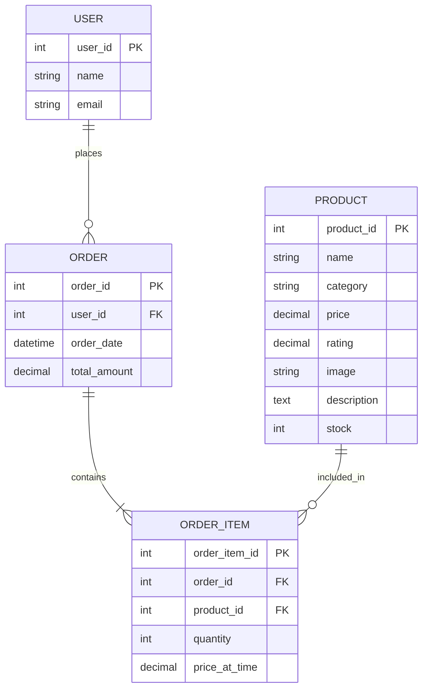

# Database Documentation and Data Model

This document outlines the data model and database design for the Mockup Amazon application.

## 1. Data Model (Entity Relationship Diagram)

Below is the conceptual data model for the application. You can use this logic to build your visual diagram in **draw.io**.

## 2. Database Design (MySQL Workbench)

The physical database design is implemented in [create_database.sql](file:///c:/Users/Bjh10/Desktop/MockupNew/MockupAmazonNew/create_database.sql). You can import this script into **MySQL Workbench** to generate the EER diagram automatically.

### Tables and Columns

#### **users**
| Column | Type | Constraints | Description |
| :--- | :--- | :--- | :--- |
| `user_id` | INT | PK, AI | Unique identifier for the user. |
| `name` | VARCHAR(100) | NOT NULL | User's full name. |
| `email` | VARCHAR(100) | UNIQUE | User's email address. |

#### **products**
| Column | Type | Constraints | Description |
| :--- | :--- | :--- | :--- |
| `product_id` | INT | PK, AI | Unique identifier for the product. |
| `name` | VARCHAR(100) | NOT NULL | Name of the product. |
| `category` | VARCHAR(50) | | Category (e.g., Electronics, Fashion). |
| `price` | DECIMAL(10,2) | NOT NULL | Price of the product. |
| `rating` | DECIMAL(3,1) | | Average user rating (0-5). |
| `image` | VARCHAR(255) | | URL to the product image. |
| `description` | TEXT | | Detailed product description. |
| `stock` | INT | DEFAULT 0 | Current inventory level. |

#### **orders**
| Column | Type | Constraints | Description |
| :--- | :--- | :--- | :--- |
| `order_id` | INT | PK, AI | Unique identifier for the order. |
| `user_id` | INT | FK | Reference to the user who placed the order. |
| `order_date` | DATETIME | DEFAULT NOW | Date and time of the order. |
| `total_amount` | DECIMAL(10,2) | | Total cost of the order. |

#### **order_items**
| Column | Type | Constraints | Description |
| :--- | :--- | :--- | :--- |
| `order_item_id`| INT | PK, AI | Unique identifier for the line item. |
| `order_id` | INT | FK | Reference to the parent order. |
| `product_id` | INT | FK | Reference to the product. |
| `quantity` | INT | NOT NULL | Number of units purchased. |
| `price_at_time`| DECIMAL(10,2) | | Price of the product at the time of purchase. |

## 3. How to Update Your Visual Files

### For draw.io:
1. Open **draw.io**.
2. Select **Arrange > Insert > Advanced > Mermaid**.
3. Copy and paste the Mermaid code from the "Data Model" section above.
4. Click **Insert** to generate the diagram automatically.

### For MySQL Workbench:
1. Open **MySQL Workbench**.
2. Go to **File > Open SQL Script** and select `create_database.sql`.
3. Run the script to create the database locally.
4. Go to **Database > Reverse Engineer**.
5. Follow the wizard to generate the EER diagram from the live database.
